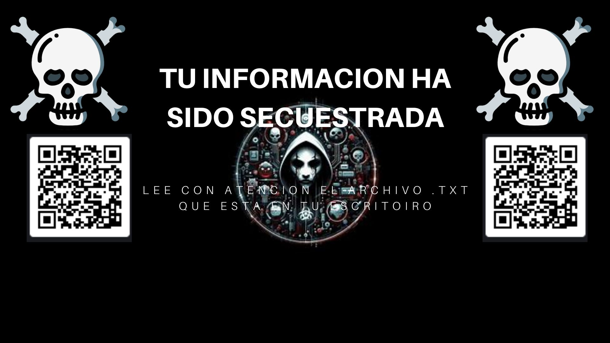

# 🔐 Encriptador y Desencriptador de Archivos

> Una prueba de concepto que implementa encriptación y desencriptación segura de archivos utilizando **AES-GCM**, con la funcionalidad adicional de cambiar el fondo de pantalla dinámicamente.



---

## Descripción

Este proyecto demuestra la capacidad de **encriptar y desencriptar** diferentes tipos de archivos de forma segura. Integra encriptación con estándar **AES-GCM** (Galois/Counter Mode) y ofrece la funcionalidad única de modificar el fondo de pantalla del sistema con imágenes descargadas desde Google Drive.

### Características Principales

 **Encriptación AES-GCM** - Algoritmo simétrico de última generación  
 **Desencriptación segura** - Recupera tus archivos protegidos  
 **Cambio de fondo dinámico** - Integración con Google Drive  
 **Múltiples tipos de archivo** - Ejecutables, imágenes, documentos y más  
 **Protección en carpetas clave** - Desktop, Pictures, Documents, etc.  

---

##  Requisitos Previos

- **Python 3.6+**
- **pip** (gestor de paquetes de Python)
- Acceso a carpetas del sistema para lectura/escritura

---

##  Dependencias

```
pycryptodome
```

---

##  Instalación

### 1. Clona el repositorio

```bash
git clone <tu-repositorio-url>
cd encriptador-archivos
```

### 2. Instala las dependencias

```bash
pip install pycryptodome
```

---

##  Uso Rápido

### Ejecutar el programa

```bash
python main.py
```

### Proceso de funcionamiento

El programa ejecutará los siguientes pasos:

1. **Solicita contraseña** - Ingresa la contraseña para desencriptación
2. **Busca archivos** - Escanea las carpetas especificadas del sistema
3. **Encripta archivos** - Aplica AES-GCM a los archivos detectados
4. **Cambia fondo** - Actualiza el fondo de pantalla del sistema

---

##  Carpetas Monitoradas

El programa busca y encripta archivos en las siguientes ubicaciones:

```
 Desktop          (Escritorio)
 Pictures         (Imágenes)
 Videos           (Vídeos)
 Music            (Música)
 Downloads        (Descargas)
 Documents        (Documentos)
```

---

##  Extensiones de Archivo Soportadas

| Categoría | Extensiones |
|-----------|-------------|
|  **Ejecutables** | `.exe`, `.dll`, `.bat`, `.cmd` |
|  **Imágenes** | `.jpg`, `.jpeg`, `.png`, `.gif`, `.bmp`, `.webp` |
|  **Documentos** | `.txt`, `.docx`, `.pdf`, `.xlsx`, `.pptx` |
|  **Audio** | `.mp3`, `.wav`, `.flac`, `.aac`, `.m4a` |
|  **Vídeo** | `.mp4`, `.avi`, `.mkv`, `.mov`, `.flv` |
|  **Bases de datos** | `.db`, `.sql`, `.sqlite` |

---

##  Funcionalidades

### Encriptación AES-GCM

Utiliza el modo **Galois/Counter Mode** para:
- Confidencialidad de datos
- Autenticación integrada
- Detección de manipulación

```python
# Ejemplo de uso interno
from Crypto.Cipher import AES
from Crypto.Random import get_random_bytes

key = get_random_bytes(32)  # 256-bit key
cipher = AES.new(key, AES.MODE_GCM)
```

### Cambio de Fondo de Pantalla

El programa descarga imágenes desde Google Drive y las establece como fondo de pantalla del sistema, proporcionando una experiencia personalizada y dinámica.

---

##  Ejemplos de Uso

### Encriptar archivos

```bash
$ python main.py
Ingresa contraseña: ****
Escaneando carpetas...
✓ Archivo encriptado: /Users/Usuario/Desktop/documento.pdf
✓ Archivo encriptado: /Users/Usuario/Pictures/foto.jpg
Fondo de pantalla actualizado ✓
```

### Desencriptar archivos

Los archivos encriptados pueden recuperarse proporcionando la misma contraseña durante la ejecución del programa.

---

##  Notas de Seguridad

 **Importante:**
- Guarda tu contraseña en un lugar seguro
- La pérdida de la contraseña resultará en archivos irrecuperables
- AES-GCM proporciona autenticación integrada contra modificaciones
- No compartir archivos encriptados sin una vía segura para la contraseña

---

##  Troubleshooting

### El programa no encuentra las carpetas
Verifica que las rutas de usuario sean correctas para tu sistema operativo.

### Error de permisos
Asegúrate de tener permisos de lectura/escritura en las carpetas del sistema.

### La imagen de fondo no se cambia
Verifica tu conexión a Google Drive y los permisos de acceso.

---

##  Autor

**[Freddy Valenzuela]**  
📧 [fgvalenzuelah5@gmail.com]

---

## Licencia

Este proyecto está bajo la **MIT License**.

Para más detalles, consulta el archivo [LICENSE](LICENSE).

---


<div align="center">

Made with ❤️ | 🔐 Seguridad en Primer Lugar

</div>
